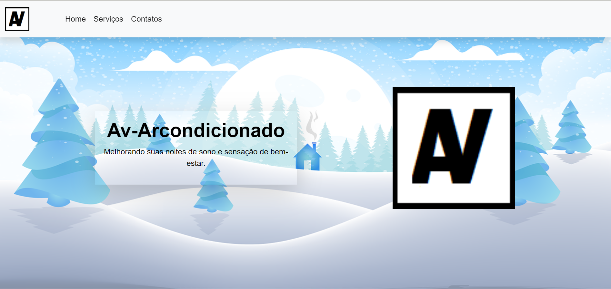
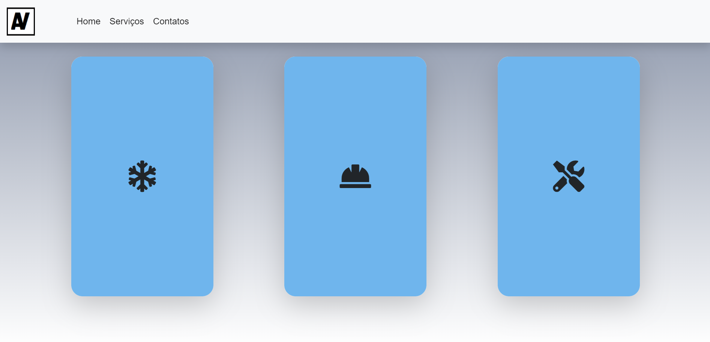
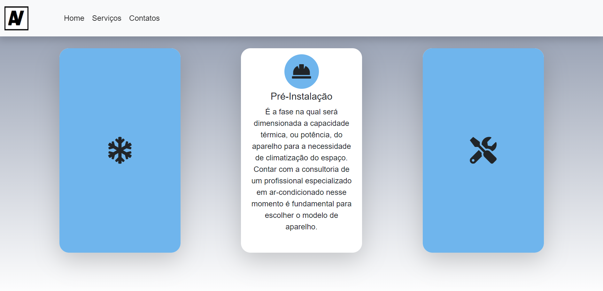
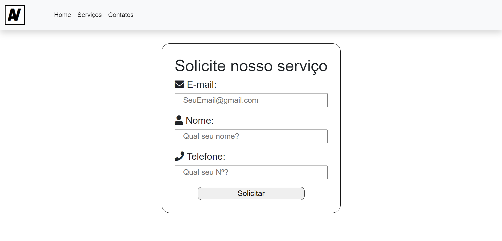
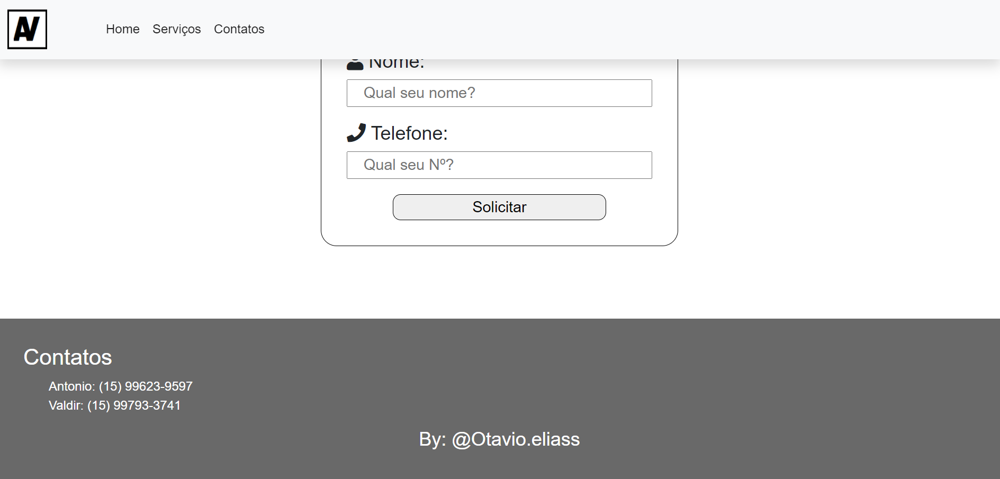
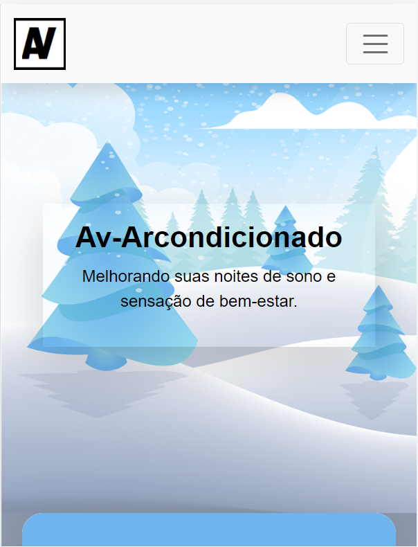
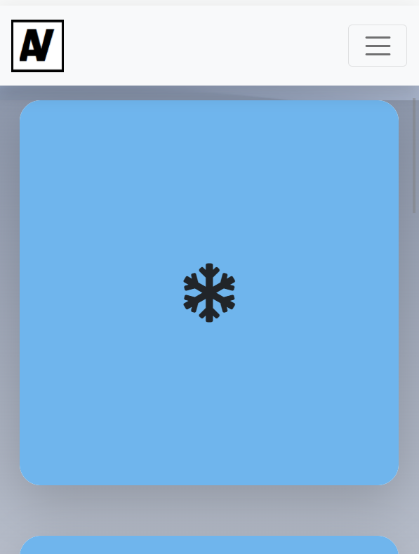
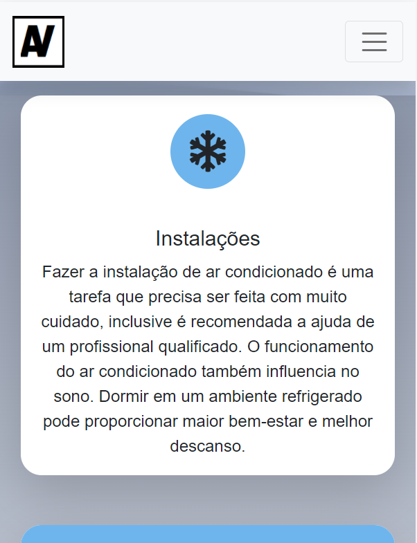
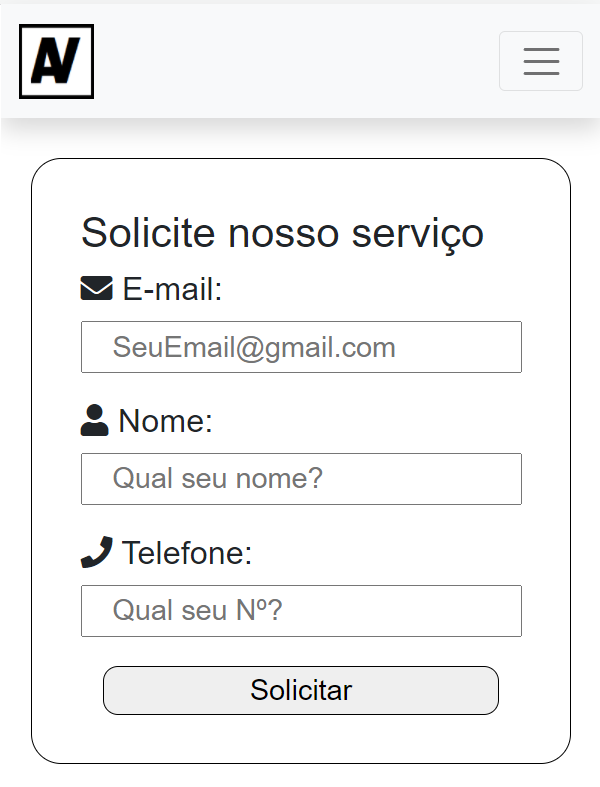
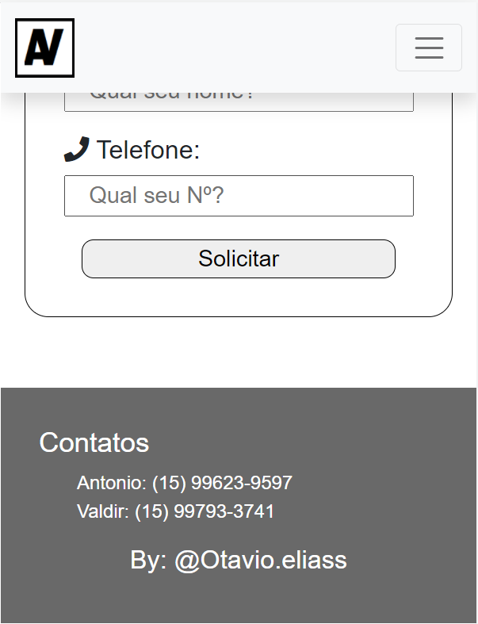

<h1>Av-Arcondicionado 2 ❄️</h1>
<h3>Landing Page</h3>

Olá, tudo bem? Nessa lading page meu propósito era melhorar um pouco mais a que fiz primeiro para meu pai, visando comparar um pouco minha evolução com o HTML e CSS dessa vez melhorando a responsavidade.

<a href="https://github.com/Otavio19/Av-Arcondicinado-LP">Como estava antes</a>

<h2>Imagens 📷</h2>

<h3>HOME</h3>

<h3>Serviços</h3>

<h3>Serviços com Hover aplicado em um dos cards</h3>

<h3>Contatos</h3>

<h3>Rodapé</h3>

<h1> Prints do projeto em 400px x 522px

  <h3>HOME</h3>

  
  <h3>Serviços</h3>

  
<h3>Serviços com Hover aplicado em um dos cards</h3>

  
  <h3>Contatos</h3>

  
  <h3>Rodapé</h3>

  
  <h1>Obrigado!</h1>
  
Desde já agradeço a você por ter visto minha landing page, espero que tenha gostado.😃👍
 
